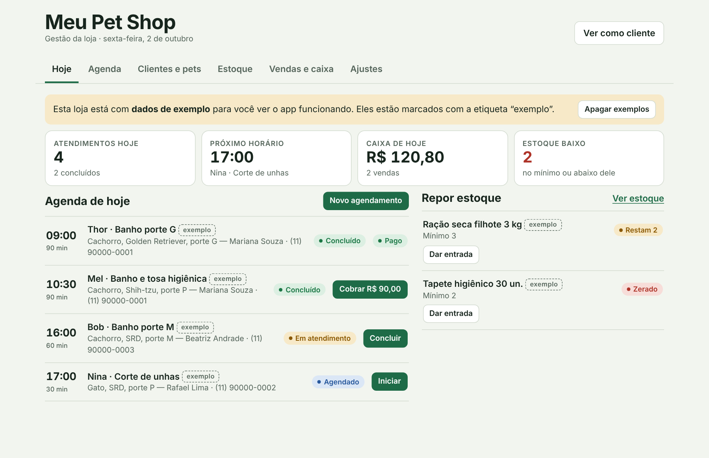
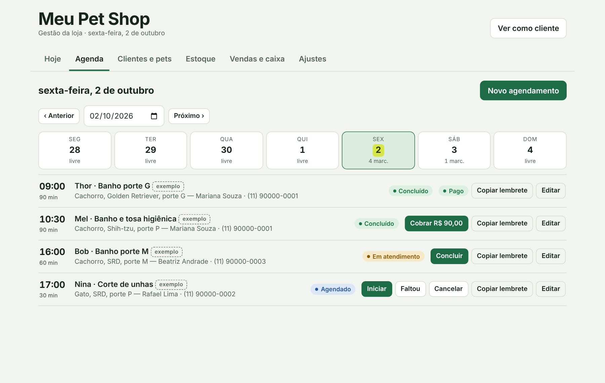
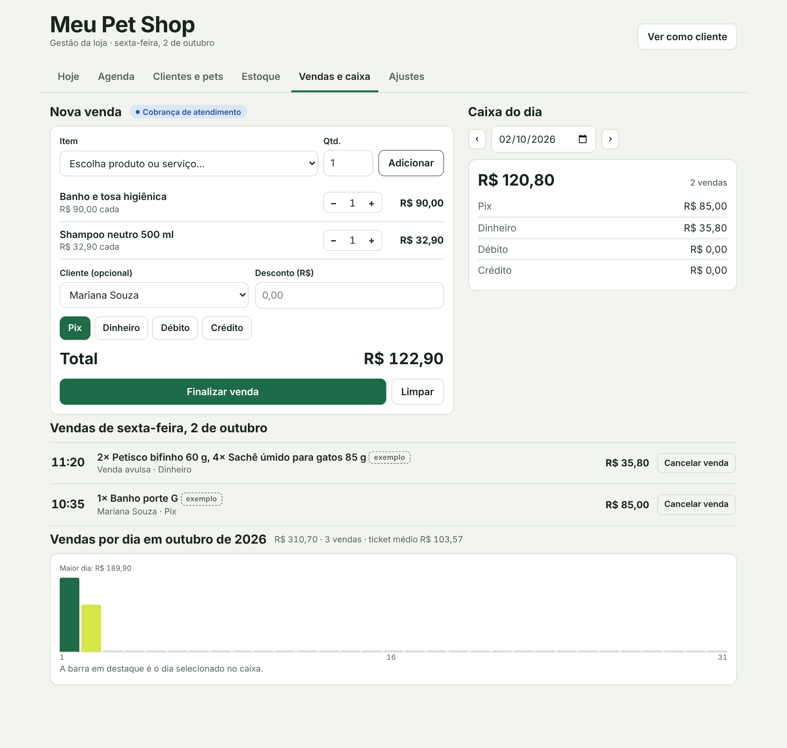
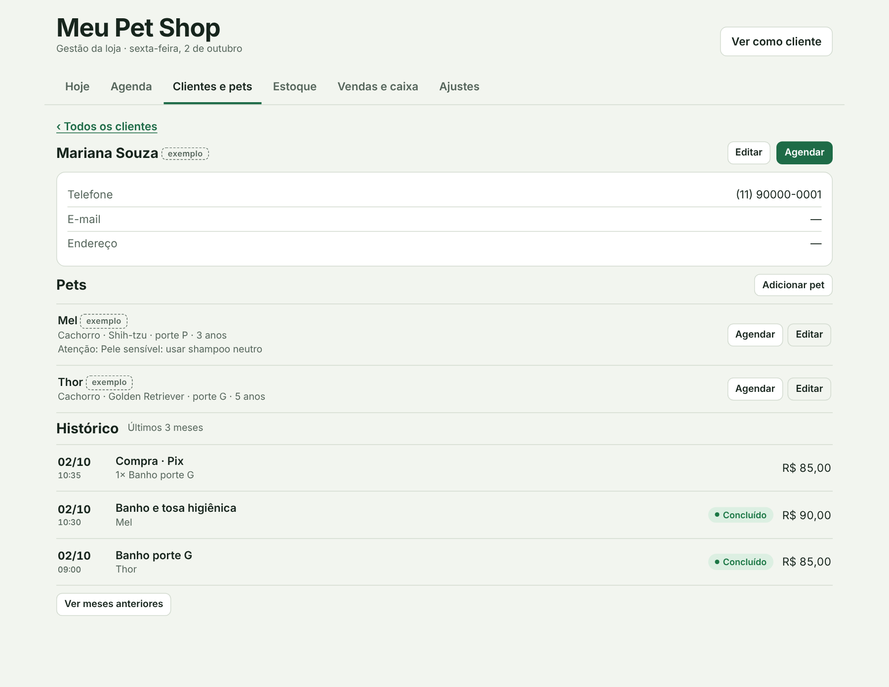
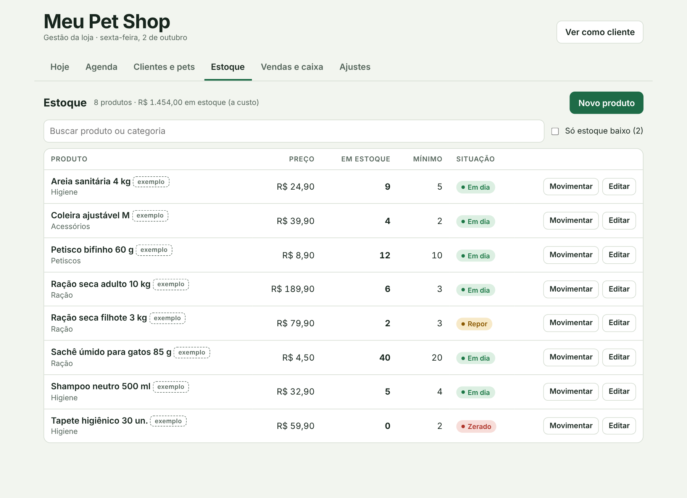
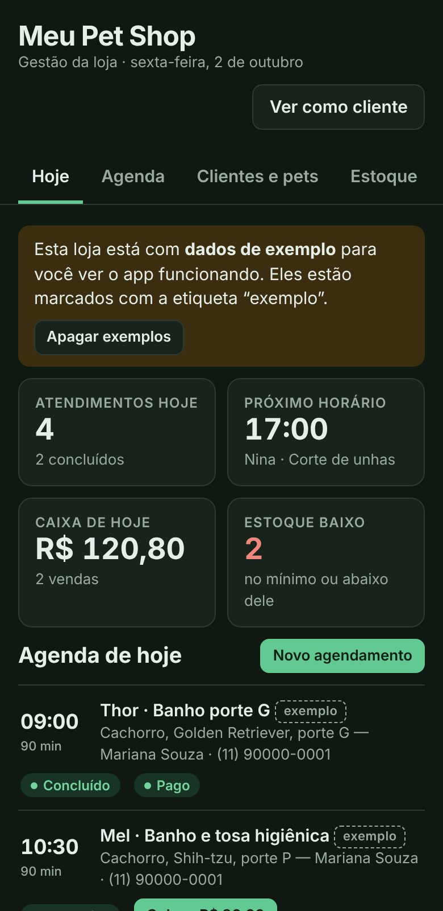

# Gestão Pet Shop

Aplicativo web para o dia a dia de um pet shop: agenda de banho e tosa, cadastro de clientes e pets, estoque e caixa. É uma página única em HTML, CSS e JavaScript puro, sem etapa de build.

## Telas

| Agenda | Vendas e caixa |
| --- | --- |
|  |  |

| Ficha do cliente | Estoque |
| --- | --- |
|  |  |

No celular, com tema escuro:

As imagens mostram o app com os dados de exemplo.

## Módulos

- **Hoje**: atendimentos do dia, próximo horário, caixa do dia e produtos para repor.
- **Agenda**: marcação de serviços em horários de 30 minutos, andamento do atendimento (agendado, em atendimento, concluído, faltou, cancelado) e lembrete pronto para copiar e enviar ao cliente.
- **Clientes e pets**: ficha do tutor, pets com espécie, raça, porte e cuidados, e histórico de atendimentos e compras.
- **Estoque**: produtos com quantidade mínima, aviso de reposição, entradas, saídas e contagem.
- **Vendas e caixa**: venda de produtos e serviços com desconto e forma de pagamento (Pix, dinheiro, débito, crédito), baixa automática no estoque, cancelamento com devolução e totais por dia e por mês.
- **Ajustes**: dados da loja, horário de funcionamento e tabela de serviços.
- **Área do cliente**: serviços, preços, contato e horários livres (botão "Ver como cliente").

## Como rodar

Abra o `index.html` no navegador, ou publique a pasta no GitHub Pages. Não há dependências para instalar.

Na primeira abertura o app carrega dados de exemplo, marcados com a etiqueta "exemplo". O botão "Apagar exemplos" na aba Hoje remove todos de uma vez.

## Onde os dados ficam

O app tem dois modos, escolhidos automaticamente:

| Onde abre | Armazenamento | Compartilhado? |
| --- | --- | --- |
| Fora do Claude (este repositório, GitHub Pages) | `localStorage` do navegador, via `dados-locais.js` | Não. Cada navegador tem seus próprios dados |
| Publicado como artefato no Claude | Banco de dados do artefato | Sim. Equipe (Editor) altera; clientes (Leitor) só consultam |

No modo local não há login nem separação entre equipe e clientes, e limpar os dados do navegador apaga tudo. Para uso real com mais de um aparelho, use a versão publicada no Claude ou troque `dados-locais.js` por um backend próprio que ofereça a mesma interface (`doc`, `collection`, `get`, `set`, `update`, `delete`, `onSnapshot`, `where`, `limit`).

## Estrutura

- `index.html`: interface, estilos e lógica do app.
- `dados-locais.js`: armazenamento local e dados de exemplo, usado só quando o app abre fora do Claude.

## Modelo de dados

Valores em centavos, datas em `AAAA-MM-DD`, horas em `HH:MM`.

- `config/loja`: nome, telefone, endereço, horário, dias e capacidade de atendimentos simultâneos.
- `servicos/{id}`: nome, preço, duração.
- `clientes/{id}` e `pets/{id}` (cada pet aponta para o cliente em `clienteId`).
- `produtos/{id}`: preço, custo, quantidade e mínimo.
- `agenda/{AAAA-MM}/itens/{id}`: agendamentos, separados por mês.
- `caixa/{AAAA-MM}/vendas/{id}`: vendas, separadas por mês.
- `ocupacao/{AAAA-MM-DD}`: quantos atendimentos ocupam cada horário, sem dados pessoais (é o que a área do cliente lê).
